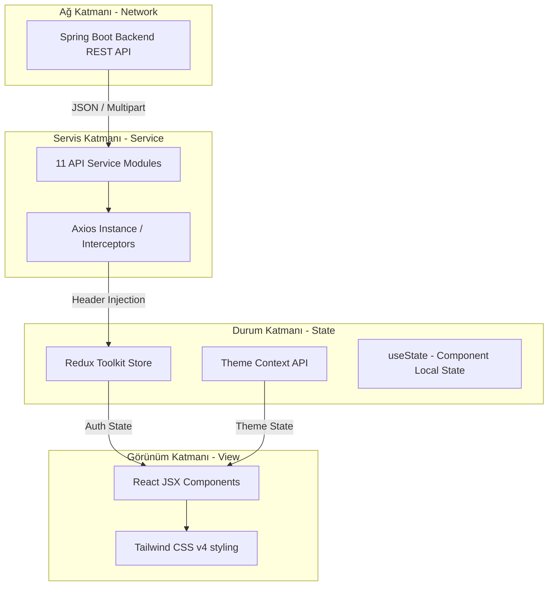

# 🎓 EduConnect — Üniversite Eğitim, Kulüp, Etkinlik ve Sosyal Etkileşim Platformu

EduConnect; üniversite ekosistemindeki tüm paydaşları (Öğrenciler, Akademisyenler, Kulüp Yetkilileri ve Sistem Yöneticileri) tek bir dijital çatı altında toplayan, çok rollü bir **Eğitim Yönetim ve Sosyal Etkileşim Platformu**'dur. 

Bu proje, geleneksel LMS (Öğrenme Yönetim Sistemleri) ile sosyal kampüs uygulamalarını tek bir bütünleşik mimaride eriten, oyunlaştırma mekanikleriyle desteklenmiş modern bir Web tabanlı Tek Sayfa Uygulamasıdır (SPA).

---

## 🚀 Öne Çıkan Özellikler ve Modüller

EduConnect, üniversite yaşamının hem akademik hem de sosyal boyutunu kapsayan 19 farklı işlevsel alanı uçtan uca yönetir:

### 🎒 1. Akademik Yönetim (LMS)
*   **Ders Kayıt Akışı (FCFS — İlk Gelen İlk Hizmet Alır):** Öğrenciler kontenjan durumuna göre ders başvurusunda bulunur; akademisyenler başvuruları anlık olarak inceleyerek onaylar veya gerekçeli reddeder.
*   **Ders Duyuruları:** Akademisyenler tarafından yayınlanan, ders kapsamındaki tüm öğrencilere anında ulaştırılan duyuru mekanizması.
*   **Ödev ve Teslim Sistemi:** Akademisyenlerin JSON ve ek PDF/Word dokümanlarıyla ödev oluşturması. Öğrencilerin ödevlerini asenkron olarak yüklemesi, güncellemesi, silmesi veya indirmesi.
*   **Notlandırma ve Geri Bildirim:** Teslim edilen ödevlerin akademisyen arayüzünde tek tek listelenmesi, puanlanması ve yazılı geri bildirimlerle değerlendirilmesi.

### 🏆 2. Sosyal & Kulüp Ekosistemi
*   **Kulüp Yaşam Döngüsü:** Öğrencilerin kulüp kurma talebi göndermesi, yöneticilerin (Admin) onayıyla kulübün kurulması ve kurucunun otomatik olarak Kulüp Yetkilisi rolünü alması.
*   **Yönetim Kurulu Yönetimi:** Kulüp yetkililerinin yönetim kuruluna yeni üyeler eklemesi (Başkan Yardımcısı, Sekreter, Sayman vb.), görev değişikliği veya yetki iptal talepleri oluşturması.
*   **Etkinlik ve Moderasyon:** Kulüplerin görsel afişler eşliğinde etkinlik oluşturması; öğrenci katılım talepleri; yetkililerin bu talepleri onaylaması ve **QR Kod Entegrasyonu** ile etkinlik girişini doğrulaması.

### 💬 3. Sosyal Platform & Blog
*   **Blog/Forum Modülü:** Öğrenci ve kulüp yetkililerinin akademik veya sosyal içerikli blog yazıları (görsel destekli) oluşturması (CRUD).
*   **Sosyal Etkileşimler:** Gönderileri beğenme, kaydetme (bookmark) ve sayfalama desteğiyle geçmişe erişim.
*   **İç İçe Yorum Sistemi (Nested Replies):** Gönderilere yorum yapabilme ve yorumlara hiyerarşik (iç içe) yanıtlar yazabilme desteği.

### 🔥 4. Oyunlaştırma (Gamification)
*   **Günlük Etkinlik Serileri (Streak):** Platformu her gün aktif kullanan öğrencilerin alev serisi (`Streak`) ve günlük etkileşim durumlarının takip edilmesi.
*   **Liderlik Tablosu (Leaderboard):** Ders başvuruları, ödev teslimleri, blog paylaşımları ve yorumlar gibi aktivitelerden kazanılan puanlarla kampüs genelinde sıralama yapılması. İlk 3 kullanıcıya özel Altın, Gümüş ve Bronz görsel vurgulamalar.

---

## 🛠 Teknoloji Yığını (Technology Stack)

EduConnect Frontend, yüksek performanslı, duyarlı ve sürdürülebilir bir geliştirme için güncel endüstri standartları gözetilerek yapılandırılmıştır:

| Katman | Teknoloji | Versiyon | Lisans | Açıklama / Amaç |
| :--- | :--- | :--- | :--- | :--- |
| **Çekirdek** | React | `19.2.0` | MIT | Bileşen tabanlı bildirimsel arayüz ve modern hook mimarisi. |
| **Build Aracı** | Vite | `7.2.4` | MIT | Hızlı HMR (Hot Module Replacement) ve optimize edilmiş derleme. |
| **Durum Yönetimi** | Redux Toolkit | `2.11.0` | MIT | Uygulama geneli kimlik doğrulama ve oturum durumlarının yönetimi. |
| **Bağlam Yönetimi** | React Context API | Yerleşik | — | Tema (Karanlık/Açık Mod) yönetimi gibi dinamik global bağlamlar. |
| **HTTP İstemcisi** | Axios | `1.13.2` | MIT | REST API entegrasyonu, otomatik token yerleştirme ve hata interceptorları. |
| **Yönlendirme** | React Router DOM | `7.10.0` | MIT | SPA yönlendirme altyapısı ve deklaratif korumalı rotalar. |
| **Tasarım & Stil** | Tailwind CSS v4 | `4.1.17` | MIT | Utility-first CSS yapısı ve yerleşik CSS değişkenleri tabanlı tema sistemi. |
| **JWT Çözücü** | jwt-decode | `4.0.0` | MIT | JWT payload'undan rol ve kullanıcı kimlik verilerinin ayrıştırılması. |
| **İkonlar** | Lucide React | `0.561.0` | ISC | Ölçeklenebilir, yüksek kaliteli SVG ikon seti. |

---

## 📐 Sistem Mimarisi ve Veri Akışı

### 1. Katmanlı Uygulama Yapısı
Uygulama, veri akışının tek yönlü ve modüler olmasını sağlamak amacıyla 4 katmanlı bir yapıda tasarlanmıştır:



### 2. Provider Hiyerarşisi (`main.jsx`)
Uygulamanın başlangıç noktasında servislerin birbirini engellemeden çalışabilmesi için kurulan sarmalayıcı mimari:

```jsx
ReactDOM.createRoot(document.getElementById('root')).render(
  <React.StrictMode>
    <Provider store={store}>       {/* Redux Global Store */}
      <ThemeProvider>              {/* Tema (Karanlık/Açık Mod) Bağlamı */}
        <BrowserRouter>            {/* React Router Yönlendiricisi */}
          <App />
        </BrowserRouter>
      </ThemeProvider>
    </Provider>
  </React.StrictMode>
);
```

---

## 🔑 Rol Tabanlı Erişim (RBAC) ve Yetkilendirme

EduConnect bünyesinde 5 temel kullanıcı rolü tanımlanmıştır. Sayfa düzeyinde yetkilendirme, deklaratif `ProtectedRoute` bileşeni ile gerçekleştirilir.

### Yetki Matrisi

| İşlev / Modül | Admin | Öğrenci | Akademisyen | Kulüp Yetkilisi |
| :--- | :---: | :---: | :---: | :---: |
| **Hesap/Başvuru Onaylama** | ✅ | ❌ | ❌ | ❌ |
| **Kullanıcı/Kulüp Silme** | ✅ | ❌ | ❌ | ❌ |
| **Ders ve Duyuru CRUD** | ❌ | ❌ | ✅ | ❌ |
| **Ödev Verme ve Notlandırma**| ❌ | ❌ | ✅ | ❌ |
| **Derse Başvurma & Ödev Yükleme**| ❌ | ✅ | ❌ | ✅ (Öğrenci rolüyle) |
| **Kulüp Kurma Talebi** | ❌ | ✅ | ❌ | ✅ |
| **Etkinlik & Moderasyon** | ❌ | ❌ | ❌ | ✅ |
| **QR Kod ile Katılım Doğrulama**| ❌ | ❌ | ❌ | ✅ |
| **Blog Yazma & Yorum Yapma** | ❌ | ✅ | ❌ | ✅ |
| **Liderlik Tablosu Görüntüleme**| ✅ | ✅ | ✅ | ✅ |

### 🛠 Örnek Kod: Korumalı Rota Yönetimi (`ProtectedRoute.jsx`)
```jsx
import { Navigate } from 'react-router-dom';
import { useSelector } from 'react-redux';

export default function ProtectedRoute({ children, allowedRoles }) {
  const { role, token } = useSelector((state) => state.auth);

  if (!token) {
    // Oturum yoksa doğrudan giriş sayfasına yönlendir
    return <Navigate to="/login" replace />;
  }

  if (allowedRoles && !allowedRoles.some(r => role.includes(r))) {
    // Kullanıcının rolü bu sayfa için yetersizse ortak dashboard'a at
    return <Navigate to="/dashboard" replace />;
  }

  return children;
}
```

---

## 📡 API Servis Katmanı ve HTTP Yapılandırması

Uygulamanın Spring Boot REST API (`http://localhost:8080/api`) ile iletişimi, asenkron Axios servisleri üzerinden yürütülür. 

### ⚙️ Merkezi Axios Yapılandırması (`axiosConfig.js`)
Uygulama genelinde HTTP istek başlıklarına JWT token eklenmesi ve 401 Unauthorized hatalarında oturumun otomatik sonlandırılması interceptor mekanizmasıyla yönetilir:

```javascript
import axios from 'axios';

const api = axios.create({
  baseURL: 'http://localhost:8080/api',
  headers: { 'Content-Type': 'application/json' },
});

// Request Interceptor: Her isteğe JWT Token yerleştirilmesi
api.interceptors.request.use((config) => {
  const token = localStorage.getItem('token');
  if (token) {
    config.headers.Authorization = `Bearer ${token}`;
  }
  // Multipart/FormData gönderimlerinde tarayıcının boundary eklemesi için başlığı sıfırla
  if (config.data instanceof FormData) {
    delete config.headers['Content-Type'];
  }
  return config;
});

// Response Interceptor: 401 Hatalarında Otomatik Logout
api.interceptors.response.use(
  (response) => response,
  (error) => {
    if (error.response?.status === 401) {
      const currentPath = window.location.pathname;
      // Login/Register gibi auth ekranlarında sonsuz döngüyü engelle
      if (['/register', '/login', '/forgot-password', '/reset-password'].includes(currentPath)) {
        return Promise.reject(error);
      }
      localStorage.clear();
      window.location.href = '/login';
    }
    return Promise.reject(error);
  }
);

export default api;
```

> [!NOTE]
> **Multipart / Form-Data Çözümü:** Etkinlik oluşturma gibi bazı dosya ve JSON verisini bir arada gönderen modüllerde, Axios'un `multipart` sınır parametrelerini (boundary) yanlış ürettiği bazı uç durumlar için doğrudan **Fetch API** kullanılarak hibrit bir veri gönderme yöntemi uygulanmıştır.

---

## 📁 Proje Klasör Yapısı

```text
EduConnect-frontend/
├── public/                         # Statik Varlıklar (Favicon, Logolar)
├── src/
│   ├── api/                        # Servis Katmanı (REST API Modülleri)
│   │   ├── axiosConfig.js          # Merkezi HTTP İstemci ve Interceptors
│   │   ├── authService.js          # Login, Register, Şifre Sıfırlama
│   │   ├── userService.js          # Profil Bilgileri ve Resim Güncelleme
│   │   ├── courseService.js        # Ders Kayıt, Başvuru ve Duyuru İşlemleri
│   │   ├── assignmentService.js    # Ödev Oluşturma, Dosya Teslim ve İndirme
│   │   ├── clubService.js          # Kulüp Üyeliği, Rol Değişim ve Yönetim
│   │   ├── eventService.js         # Etkinlik Kayıt, Başvuru ve QR Kod Doğrulama
│   │   ├── postService.js          # Blog CRUD, Beğeni, Yorum ve Yanıt Sistemi
│   │   ├── adminService.js         # Sistem Moderasyon Onayları ve Arşiv
│   │   ├── academicianService.js   # Akademisyen Yetkilendirmeleri
│   │   └── gamificationService.js  # Liderlik Tablosu ve Puan Verileri
│   ├── components/
│   │   ├── ProtectedRoute.jsx      # Rol Bazlı Erişim Koruma Bileşeni
│   │   └── profile/
│   │       └── UserProfileTab.jsx  # Profil Kartı ve Ayarlar Bileşeni
│   ├── context/
│   │   └── ThemeContext.jsx        # Karanlık/Açık Mod Context Altyapısı
│   ├── pages/                      # Sayfa ve Dashboard Bileşenleri
│   │   ├── auth/                   # Auth Ekranları (Login, Register, Pw Reset)
│   │   ├── admin/
│   │   │   └── AdminDashboard.jsx   # Sistem Yöneticisi Paneli
│   │   ├── student/
│   │   │   └── StudentDashboard.jsx    # Öğrenci Dashboard (Çok Sekmeli)
│   │   ├── instructor/
│   │   │   └── InstructorDashboard.jsx # Akademisyen Dashboard
│   │   ├── clubofficial/
│   │   │   └── ClubOfficialDashboard.jsx # Kulüp Başkanı / Çift Kimlik Dashboard
│   │   ├── club/
│   │   │   └── ClubList.jsx        # Kulüp Arama ve İnceleme Ekranı
│   │   ├── post/                   # Sosyal Blog (List, Detail, Create, Edit)
│   │   └── gamification/
│   │       └── Leaderboard.jsx     # Liderlik Tablosu (Gamification UI)
│   ├── store/                      # Redux Store Konfigürasyonu
│   │   ├── store.js                # Global Store
│   │   └── slices/
│   │       └── authSlice.js        # Giriş/Çıkış ve Token State Dilimi
│   ├── utils/                      # Yardımcı Fonksiyonlar ve Formatlayıcılar
│   ├── assets/                     # CSS ve Görsel Varlıklar
│   ├── App.jsx                     # Rota Tanımları (Routing) ve Tema Kontrolü
│   ├── main.jsx                    # Uygulama Başlangıç Noktası (Root)
│   ├── index.css                   # Global CSS Değişkenleri ve Tailwind v4
│   └── App.css
├── index.html                      # SPA Temel HTML Şablonu
├── vite.config.js                  # Vite Konfigürasyon Dosyası
├── package.json                    # Bağımlılıklar ve Komut Tanımları
└── eslint.config.js                # ESLint Standartları
```

---

## ⚡ Performans Optimizasyonları ve İstatistikler

Projenin geliştirme sürecinde kullanıcı deneyimi ve ağ optimizasyonu için çeşitli metotlar uygulanmıştır:

*   **Tembel Yükleme (Lazy Loading):** Dashboard'lar üzerinde sekme bazlı koşullu render yöntemi uygulanmıştır. Bu sayede ilk açılışta tüm API isteklerinin bir anda atılması engellenmiş, ilk yüklemedeki API isteği sayısı **%42 azaltılmıştır** (19 istekten 11 isteğe düşürülmüştür).
*   **Önbellek Atlatma (Cache Busting):** Kritik veri değişikliklerinden (onaylama, başvuru vb.) sonra eski verinin gösterilmesini engellemek için GET isteklerine zaman damgası parametresi (`_t: Date.now()`) entegre edilmiştir.
*   **Granüler Yükleme Durumları:** Sayfa genelinde tek bir `loading` kontrolü yerine bölüm bazlı yükleme nesnesi (`loading: { courses: true, assignments: false, ... }`) kullanılarak bölgesel yükleme animasyonları (skeleton/spinner) sağlanmıştır.

### Deneysel Lighthouse Skorları (Mobil)
*   **Erişilebilirlik (Accessibility):** `92 / 100` (ARIA standartları, klavye uyumluluğu ve yüksek kontrastlı renk seçimleri ile).
*   **En İyi Uygulamalar (Best Practices):** `95 / 100`.
*   **Performans (Performance):** `89 / 100` (Yerel sunucuda LCP süresi ortalama 1.2s altında ölçülmüştür).

---

## 🚀 Kurulum ve Çalıştırma

Projeyi yerel bilgisayarınızda çalıştırmak için aşağıdaki adımları takip edebilirsiniz:

### Gereksinimler
*   Node.js (`v20.0.0` veya üzeri LTS sürümü tavsiye edilir)
*   npm veya yarn paket yöneticisi
*   Çalışır durumda olan Spring Boot backend servisi (`http://localhost:8080`)

### 1. Projeyi İndirin ve Bağımlılıkları Yükleyin
```bash
# Bağımlılıkları yükleyin
npm install
```

### 2. Geliştirme Ortamında Çalıştırın
```bash
# Yerel geliştirme sunucusunu başlatın
npm run dev
```
Uygulama varsayılan olarak `http://localhost:5173` adresinde çalışmaya başlayacaktır.

### 3. Production Build Alın
```bash
# Tarayıcılar için optimize edilmiş üretim paketini oluşturun
npm run build

# Üretim çıktısını yerel olarak önizleyin
npm run preview
```

---

## 💡 Gelecek Geliştirme Önerileri
1.  **WebSocket Bildirimleri:** Sunucu kaynaklı anlık bildirimler için SSE (Server-Sent Events) veya WebSocket altyapısının kurulması.
2.  **Uluslararasılaştırma (i18n):** `i18next` kütüphanesi entegrasyonu ile Türkçe ve İngilizce çoklu dil desteğinin kazandırılması.
3.  **İstemci Testleri:** Vitest ile birim (unit) testlerin, Playwright ile uçtan uca (E2E) testlerin yazılması.
4.  **PWA Desteği:** Offline kullanım ve mobil cihazlara yüklenebilirlik için Service Worker'ların eklenmesi.
